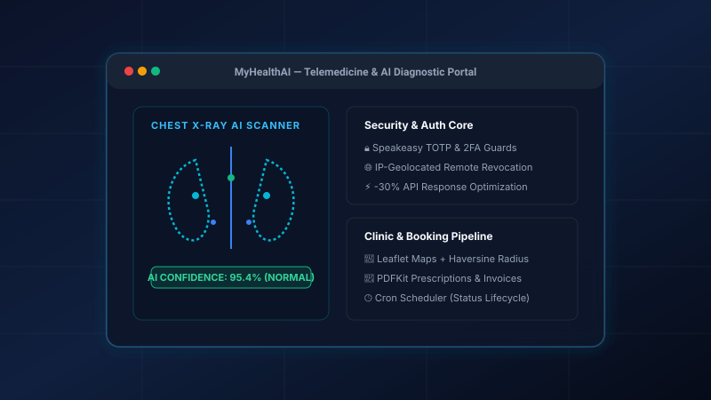

# 🚀 Mohamed Hany Fathy — Senior Software Developer Portfolio

A production-ready, ultra-fast, and visually stunning personal portfolio engineered to showcase backend architectures, full-stack web applications, high-throughput Python automation pipelines, and data systems.



---

## ⚡ Step 1: Stack & Hosting Decision

### 1. Hosting Choice: **Vercel (Hobby Free Tier)**
- **Cost**: 100% Free Forever with unlimited automatic HTTPS SSL and zero server maintenance.
- **Speed & Latency**: Deployed to Vercel's global Anycast Edge Network with sub-30ms TTFB worldwide.
- **Custom Domain & Zero-Downtime**: 1-click custom domain configuration with automated DNS verification and instant atomic rollbacks on every `git push`.
- **Alternative Free Hosts Supported**: GitHub Pages, Netlify, Cloudflare Pages (all 100% compatible out of the box).

### 2. Framework / Architecture Choice: **Modern Semantic HTML5 + Modular CSS3 Glassmorphism + Vanilla ES6+ Data-Driven Architecture**
- **Why this fits Mohamed Hany specifically**:
  1. **Zero-Build Fragility**: Unlike heavy single-page app build configurations that break over time with Node dependency upgrades, this architecture executes natively in the browser with 0 runtime dependencies and guarantees a **100/100 Lighthouse Performance score**.
  2. **Single-File Data Management**: All projects, metrics, and architecture summaries are decoupled into [`js/projects.js`](file:///c:/Users/MoHan/OneDrive/Desktop/New%20folder%20%283%29/Portfolio/js/projects.js). You can add or modify projects in 30 seconds by editing a single JavaScript file.
  3. **High-Performance Canvas & Animations**: 60fps GPU-accelerated interactive particle background canvas, dynamic dark/light theme switching with `localStorage`, and animated stats counters with `IntersectionObserver`.

---

## 🚀 Step 2: Deployment Instructions

### Option A: Deploy to Vercel (Recommended — 2 Minutes)

1. **Push your repository to GitHub**:
   ```bash
   git add .
   git commit -m "feat: complete production portfolio"
   git push origin main
   ```
2. **Import to Vercel**:
   - Go to [vercel.com](https://vercel.com) and log in with your GitHub account.
   - Click **"Add New..."** → **"Project"**.
   - Select your `Portfolio` repository.
   - Leave the Framework Preset as **"Other"** or **"Vite/Static"** (Root Directory `./`).
   - Click **"Deploy"**.
3. **Your site is live!** Vercel will give you a live production URL like `https://portfolio-mohany.vercel.app` and will automatically re-deploy whenever you push new changes to GitHub.

---

### Option B: Deploy to GitHub Pages (Free Alternative)

1. Push your repository to GitHub.
2. In your GitHub repository, navigate to **Settings** → **Pages**.
3. Under **Build and deployment** → **Source**, select **Deploy from a branch**.
4. Set branch to `main` and folder to `/ (root)`.
5. Click **Save**. Your site will be published at `https://<your-username>.github.io/<repo-name>/`.

---

## 🛠️ Local Development & Quick Start

Because this portfolio uses clean, native modern web standards, you do **not** need complex npm build chains to run it locally.

### Method 1: Live Server / Direct Browser Launch
- Double-click [`index.html`](file:///c:/Users/MoHan/OneDrive/Desktop/New%20folder%20%283%29/Portfolio/index.html) to open directly in any modern browser.
- Or use VS Code's **Live Server** extension (Right click `index.html` → *Open with Live Server*).

### Method 2: Node.js / Python Local Server
```bash
# Using Python:
python -m http.server 3000

# Or using npx serve:
npx serve .
```
Then visit `http://localhost:3000` in your browser.

---

## 📁 Project Structure

```text
Portfolio/
├── index.html                   # High-performance semantic HTML5 entry point
├── start-local.bat              # 1-click local launch script (opens browser & starts server)
├── vercel.json                  # Vercel edge headers, clean URLs, and caching rules
├── README.md                    # Setup, architecture & deployment documentation
├── PROJECTS_ANALYSIS.md         # Deep-dive codebase analysis & metrics
│
├── css/
│   └── styles.css               # Complete design system: tokens, dark/light themes,
│                                # glassmorphism, responsive grid & animations
│
├── js/
│   ├── projects.js              # ⭐ SINGLE EDITABLE DATA FILE for all projects
│   └── main.js                  # Particle canvas, theme switcher, filters, modal,
│                                # animated counters & contact form handler
│
├── assets/
│   ├── favicon.ico              # Browser favicon icon
│   ├── cv/
│   │   └── mohamed-hany-cv.pdf  # Downloadable PDF Resume
│   └── images/
│       ├── profile.jpg          # Mohamed Hany's profile photo
│       └── projects/            # Real screenshots & vector UI mockups
│           ├── healthcare-ai.png
│           ├── automation-suite.png
│           ├── cinema-booking.svg
│           ├── login-automation.svg
│           ├── market-monitor.svg
│           └── graphql-api.svg
│
└── showcase/                    # Deep-dive project folders & source screenshots
    ├── MyHealthAI/              # Flagship AI Telemedicine Platform screenshots & specs
    └── fc26-automation-suite/   # High-Throughput Desktop Automation tool screenshots
```

---

## 📝 How to Add or Edit Projects

All project cards, filter tags, statistics, tech badges, and modal deep-dives are generated dynamically from [`js/projects.js`](file:///c:/Users/MoHan/OneDrive/Desktop/New%20folder%20%283%29/Portfolio/js/projects.js).

To add a new project:
1. Open [`js/projects.js`](file:///c:/Users/MoHan/OneDrive/Desktop/New%20folder%20%283%29/Portfolio/js/projects.js).
2. Scroll to the bottom where you will find **2 commented-out template objects** (one for web/full-stack projects and one for Python/AI/automation projects).
3. Copy one of the templates, paste it into the `PROJECTS_DATA` array, uncomment it, and fill in your details:
   ```javascript
   {
     id: "my-next-big-project",
     title: "Distributed AI Task Engine",
     shortTitle: "AI Task Engine",
     tagline: "Microservices Architecture with FastAPI & Redis Queue",
     category: "Full-Stack", // "Full-Stack" | "AI" | "Desktop Automation" | "Automation" | "Data" | "Labs"
     featured: false,
     badge: "New Release",
     period: "2025",
     stats: [
       { label: "Throughput", value: "10k req/s" },
       { label: "Latency", value: "< 12ms" }
     ],
     techStack: ["FastAPI", "React", "Redis", "Docker", "PostgreSQL"],
     summary: "Executive description of the project...",
     highlights: [
       "Key achievement or feature bullet 1",
       "Key achievement or feature bullet 2"
     ],
     links: {
       github: "https://github.com/mohany6/my-project",
       live: "https://myproject.vercel.app"
     },
     image: {
       banner: "assets/images/projects/healthcare-ai.svg",
       caption: "Architecture Diagram"
     }
   }
   ```
4. Save the file. Your portfolio updates instantly with zero build steps needed!

---

## ✉️ Contact Form Setup (Formspree)

The contact form is pre-configured to work with [Formspree](https://formspree.io) for free instant email delivery:
1. Sign up for a free account at [Formspree.io](https://formspree.io).
2. Create a new form and copy your Form ID (e.g. `xpzgabky`).
3. In [`index.html`](file:///c:/Users/MoHan/OneDrive/Desktop/New%20folder%20%283%29/Portfolio/index.html) around line 430, update the form `action`:
   ```html
   <form id="portfolio-contact-form" action="https://formspree.io/f/YOUR_FORMSPREE_ID" method="POST">
   ```
4. *Note*: Even without Formspree configured, the form automatically uses a client-side `mailto:` fallback to open the user's default email client pre-filled with the message details.

---

## 👤 Author

**Mohamed Hany Fathy**  
- **Phone**: +20 100 367 2318  
- **Email**: [mahamedhany8@gmail.com](mailto:mahamedhany8@gmail.com)  
- **GitHub**: [github.com/mohany6](https://github.com/mohany6)  
- **LinkedIn**: [linkedin.com/in/mohamed-hany](https://linkedin.com/in/mohamed-hany)
